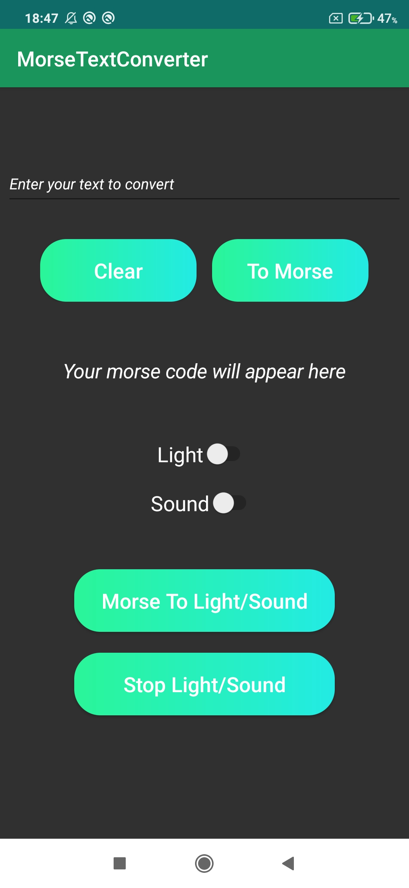
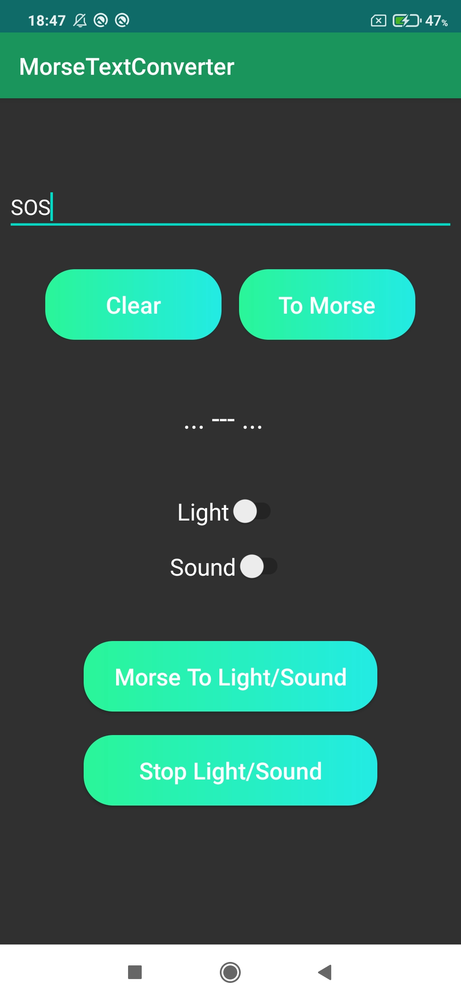

# OurAndroidApp - MorseTextConverter

## Table of Contents

1. [General Info](#general-info)
2. [How it works](#rules-of-the-game)
3. [Technologies](#technologies)
4. [Installation](#installation)
5. [Contribution](#contribution)
6. [Suggested improvement](#suggested-improvement)

## General Info

---

The purpose of this application is to convert a text into Morse code and, if desired, to transmit it into light and sound signals.

### Screenshot

---

    
    

### How it works

---

-

## Technologies

---

A list of technologies used within the project:

-   [Android Studio](https://developer.android.com/studio): Version 2021.3.1
-   [Java](https://www.java.com/fr): JDK 18

## Installation

---

A little intro about the installation.

## Conbtribution

---

-   Théo Capitaine, Developer: t9capita@enib.fr
-   Mathis Moizant, Developer: m9moizan@enib.fr

## Suggested improvement

---
